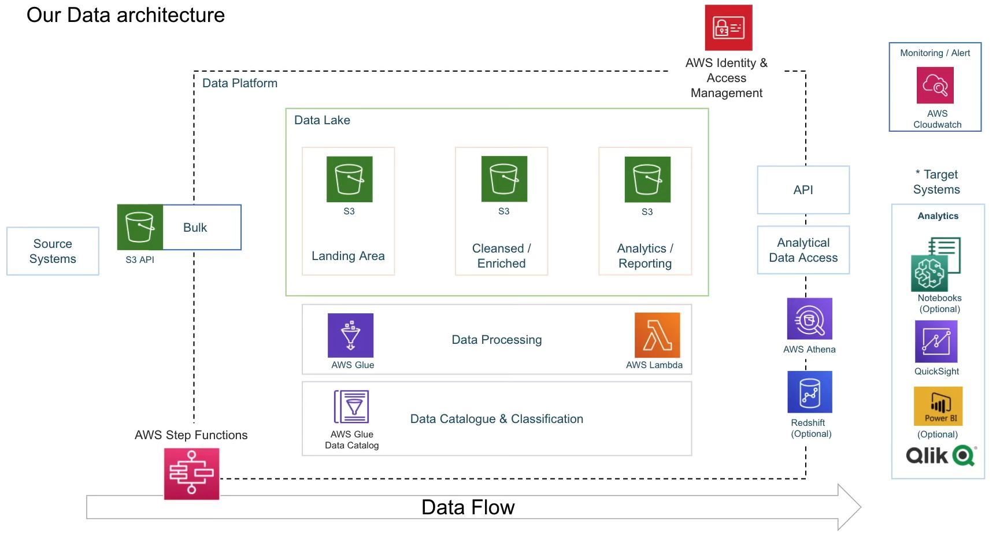
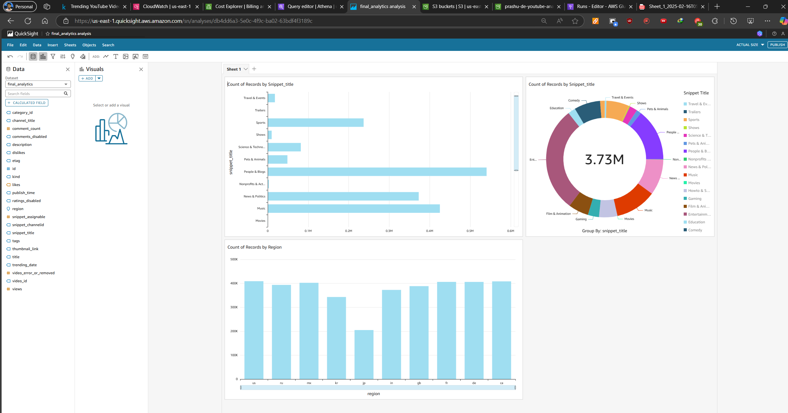

# Prasad Data Engineering - YouTube Analysis Project 

A cloud-based data engineering solution to analyze YouTube trending videos data efficiently.

## Problem Statement
Managing and analyzing large-scale YouTube data (structured/semi-structured) across regions poses challenges:
- **Multiple Data Sources**: Daily CSV files per region with inconsistent formats.
- **ETL Complexity**: Raw data needs transformation for analysis.
- **Scalability**: Handling growing data volumes efficiently.
- **Centralized Storage & Reporting**: Lack of unified data repository and BI insights.

## Solution
1. **Data Ingestion**: Collect CSV/JSON data from Kaggle into AWS S3.
2. **Serverless ETL (AWS Glue/Lambda)**: Clean, transform, and categorize raw data.
3. **Data Lake (S3)**: Store processed data in partitioned formats (e.g., by region/category).
4. **Querying (Athena)**: Analyze data directly in S3 using SQL.
5. **Dashboard (QuickSight)**: Visualize trends, top videos, and category performance.

## Tech Stack
- **Data Ingestion**: AWS Lambda (Serverless), S3 Buckets
- **Storage**: Amazon S3 (Data Lake)
- **ETL**: AWS Glue (Serverless Spark), AWS IAM (Security)
- **Analytics**: AWS Athena (SQL Querying)
- **Visualization**: Amazon QuickSight (BI Dashboards)

## Key Features
- **Scalable**: Serverless AWS services handle data growth automatically.
- **Cost-Effective**: Pay-per-use model with no upfront costs.
- **Centralized Data Lake**: Single source of truth for all regions/categories.
- **Fast Insights**: Athena enables ad-hoc SQL queries on S3 data.

## Dataset Used
[Kaggle YouTube Trending Dataset](https://www.kaggle.com/datasets/datasnaek/youtube-new)  
- Includes daily trending videos (CSV) and category mappings (JSON) for multiple regions (US, GB, DE, etc.).

## Project Setup
1. **AWS Setup**: Create IAM roles for Glue, Lambda, and Athena.
2. **Data Ingestion**: 
   - Upload raw CSV/JSON files to S3.
   - Trigger Lambda to preprocess data.
3. **ETL Job**: 
   - Run Glue Crawler to infer schema.
   - Transform data using Glue ETL jobs.
4. **Analysis**:
   - Query data in Athena.
   - Connect Athena to QuickSight for dashboards.

**Acknowledgments**: Kaggle dataset providers, AWS Documentation.
